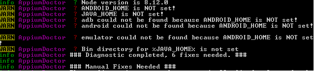
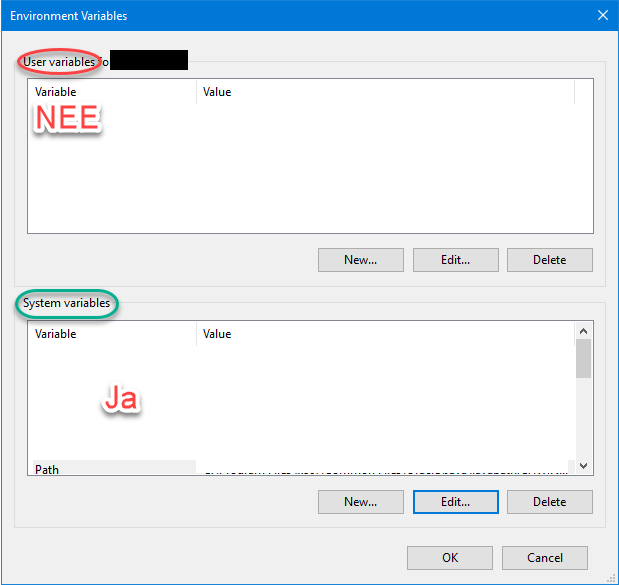

# Setup

## Algemeen

Hierbij een korte beschrijving van een aantal problemen waar ik tegenaan gelopen ben en hoe ik ze heb opgelost. Ik heb geen tijd gehad een stap voor stap beschrijving te maken hoe het hele project in elkaar steekt. dit zijn enkel wat problemen die niet met 1 min googlen te fixen waren.

Deze stappen zijn gebaseerd op het gebruik van de Appium UI applicatie.

Uitgebreide documentatie van Appium is te vinden op [Appium.io](http://appium.io).

[visual studio emulaor for android](https://visualstudio.microsoft.com/vs/msft-android-emulator/)

## Vooraf

Een aantal zaken moeten geïnstalleerd zijn om met dit project te kunnen werken.
Voor de programma’s met een ^ kunnen ook andere programma’s gebruikt worden.

* (IDE) [VisualStudio](https://visualstudio.microsoft.com/vs/community/)^
* (Package manager) [NugetPackageManager](https://www.npmjs.com/)^
* (Android emluator) [visual studio emulaor for android](https://visualstudio.microsoft.com/vs/msft-android-emulator/)^
* [Android SDK](https://developer.android.com/studio/)

Download en instaleer androidstudio(AS). Wanneer je AS voor het eerst opstart krijg je de optie de Android SDK te instaleren (onthoud waar je de SDK installeert)

* [Appium](https://github.com/appium/appium-desktop/releases)

## Stap 1 - Omgeving Setup

[Appium-doctor]((https://www.npmjs.com/package/appium-doctor)) is een comandline applicatie controleert of alles goed ingesteld is voor het gebruik van appium.
Na dat nmp geïnstalleerd is open CMD en run het volgende commando.

``` cmd
> npm install appium-doctor -g
```

Zodra appium-doctor klaar is met instaleren draai de test(locatie maakt niet uit):

``` cmd
> appium-doctor --android
```

## Stap 1.5 - Problemen oplossen

Afhankelijk van de status van je machine geeft appium-doctor aan dat onderdelen handmatig opgelost moeten worden. Hieronder vind je oplossingen voor een aantal van deze problemen.



### 1.5.1 Android_Home is NOT Set

De locatie van de antroid SDK moet in de ENVIROMENT_VARIABLES van je machine staan:

Op [deze site](http://www.automationtestinghub.com/setup-android-environment-variables/) kun je vinden hoe.

### 1.5.2 Bin directory fir %Java_Home% is NOT set

In het ENVIROMENT_VARIABLES scherm (zie 1.5.1) staat ook een PATH variabelen. Voeg aan het einde van de Path de volgende line toe

``` cmd
%JAVA_HOME%\bin
```

LETOP! Dit moet in de systeem variabelen niet in de user variabelen.



## Stap 2 - Het project.

als al deze problemen zijn opgelost kun je het project laden in visual studio.

## Andere problemen

### waar kan ik de naam van een Image vinden?

Om de driver met een emulator te verbinden moet je de naam van het device weten. Later heb je mogelijk ook het ID nummer van het device nodig. De beste (Meest zekere) manier die ik heb gevonden is door de volgende commands in het comandpromt in te voeren.

Ga naar de file met de Emulator images:

``` cmd
> cd %programfiles(x86)%\Microsoft Emulator Manager\1.0\
```
Print een lijst van de geïnstalleerde images

```cmd
> emulatorcmd.exe /sku:Android /type:device list
```
Om meer informatie over een specifiek image te krijgen:

```cmd
> emulatorcmd.exe /sku:Android /type:device /id:{ID VAN IMAGE} detail
```
### Appium zecht dat er geen device aangesloten is.

Mogelijk is je device niet verbonden met de de Android Debugging Bridge.

Ga in de commandline naar ``(pad waar  andriodSDK geinstaleerd staat)/Android/platform-tools``

Hier zou je toegang moeten hebben tot het ``adb`` command.

> dit kun je testen met:
> ``` cmd
> > adb help
> ```

Om verbinding met de emulator te maken gebruik je:

``` cmd
> adb connect (IP device)
```

Je kunt het Ip van je emulator in visual studio deveice emulator vinden door op de tools knop te drukken in de toolbar.


Je vindt het juiste addres onder Network -> Emulator Adapter #1 -> Network addresses.
Het gaat over het addres dit format: ``111.222.333.444``

## Disired capabilities

Appium werkt met desired capabilities.
Een overzicht van alle mogelijkheden is [hier](http://appium.io/docs/en/writing-running-appium/caps/) te vinden.

Voor dat je ze in de
